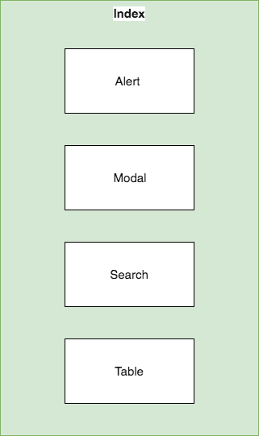

## Go Notify
Gojek frontend interview assignment.
Create a react app to allow communicate messages personally to drivers via notification

A simple react web app which allow a list of drivers to be notified with customised message.

## Project Overview
The notification components consist of a stateful Index component and the rest of child components are stateless.
The state manipulate is minimum which only happens at top most level thus reduce debugging and maintenance effort.
This has <b>no</b> state management architecture because it is meant to be into any existing projects easily such as [Redux](https://redux.js.org) without much code fiddling.

The component design diagram as below;


## Getting started
```
npm install
npm start
```

### Unit test
```
npm run test:unit
```

### Integration test
```
npm run test:ui
```

### How to use
After complete setup and installation, navigate to `http://localhost:1234/` 

You can search for driver by filter ID, Name or Email. The page only show active driver by default. You may uncheck the checkbox to search for suspended drivers.

### Design considerations
 The page is heavily focus on CSS flexbox to achieve best responsiveness. The underlying table component consists of many card elements.